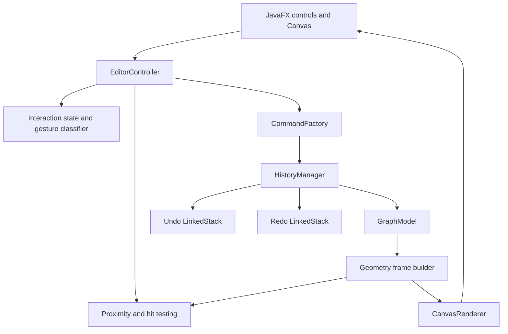
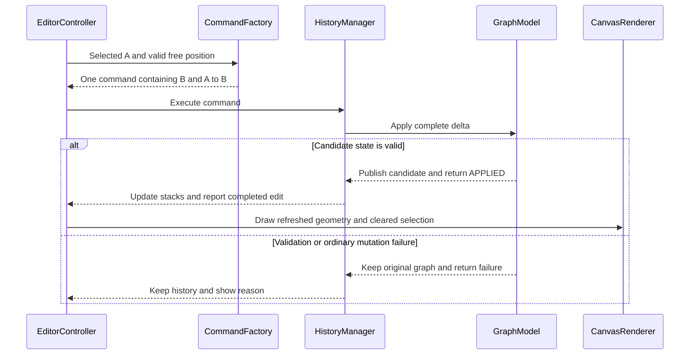

# JavaFX Node and Arrow Editor — System Architecture

**Version:** 1.0  
**Research date:** 3 September 2026  
**Status:** Proposed implementation architecture; no completed JavaFX application is claimed.  
**Companion:** [System Design](system-design.md)

## 1. Architectural approach

Use a small, layered desktop application with a model–view–controller separation, immutable graph records, command-based edits, and two custom linked-list history stacks.

The graph is the authoritative state. JavaFX Canvas renders that state; mouse events express user intent; commands perform complete reversible edits. Geometry is shared between rendering and hit testing so the object the user clicks matches what is drawn.

The system design is authoritative for interaction behaviour, including proximity selection, click-versus-drag classification, one-shot automatic connection, and history boundaries. This document defines how those behaviours should be implemented.



Arrows show the principal runtime flow of events, edits, and derived data. They are not Java package-import dependencies. In particular, `GraphModel` does not depend on the UI or call the renderer; the controller requests a fresh geometry frame after a completed change.

## 2. Research that informs the architecture

| Verified finding | Architectural consequence | Source |
| --- | --- | --- |
| A Canvas receives drawing commands into an image and clips to its dimensions. | Keep graph entities outside the canvas and redraw from them. | [R1] |
| Ordinary mouse dragging remains associated with the pressed JavaFX target; a click can follow a drag. | Classify the gesture centrally and perform a single release action. | [R3] |
| An attached Canvas and its graphics context must be modified on the JavaFX Application Thread. | Confine live graph edits, history operations, and rendering to that thread. | [R2] |
| Commands encapsulate operations and can support undo history. | Store graph deltas in edit objects instead of recording raw mouse events. | [R6] |
| Compound edits redo in forward order and undo in reverse order. | Create endpoints before arrows and restore dependencies in the inverse order. | [R7] |
| Java `LinkedList` is doubly linked and implements `Deque`; deque operations also represent LIFO stacks. | A linked implementation satisfies the requested history structure. A custom singly linked stack makes that implementation explicit. | [R4], [R5] |
| `TreeMap` orders keys and provides logarithmic key lookup and updates. | Use stable numeric IDs as ordered keys to preserve drawing order after restoration. | [R8] |
| JavaFX 26 requires JDK 24 or later. | A proposed JDK 25 / JavaFX 26 baseline is compatible; do not pair JavaFX 26 with JDK 21. | [R10] |

The exact constants, class boundaries, geometry formulas, and UI policies are engineering choices for this project, rather than recommendations claimed to come directly from these sources.

## 3. Why Canvas is the chosen rendering model

| Option | Advantages for this project | Costs | Decision |
| --- | --- | --- | --- |
| An actual `Canvas` with `GraphicsContext` | Meets the explicit canvas requirement; one drawing surface; geometry and history remain visible in the code. | Requires manual hit testing and redraw management. | Selected. |
| A `Pane` containing `Circle`, `Line`, and `Polygon` scene-graph objects | Individual objects can receive events and have property bindings. | Introduces a different rendering approach and many UI objects to synchronize with history. | Reasonable alternative if the canvas requirement changes. |

In the selected design, a drawn `GraphNode` is not a JavaFX event target. All circles are pixels inside one Canvas. The default press-drag-release gesture is therefore sufficient: the controller identifies graph nodes geometrically. `startFullDrag()` would become relevant if endpoints were separate scene-graph objects requiring their own drag events. This distinction follows the event-target behaviour in the JavaFX documentation. [R1], [R3]

Do not rely on a list of JavaFX `Circle` objects as the graph model, and do not store screenshots for undo. Saving graphics-context state is also insufficient: that stack holds rendering attributes rather than node/arrow history. [R2]

## 4. Components and ownership

| Component | Owns or performs | Must not do |
| --- | --- | --- |
| `EditorApplication` | Application startup, dependency construction, stage lifecycle. | Geometry, history decisions, or graph algorithms. |
| `EditorView` | Toolbar, status text, ScrollPane, Canvas, viewport coordinate checks. | Modify graph collections. |
| `EditorController` | Convert events into application actions; coordinate cancellation, edits, feedback, and rendering. | Directly insert/remove nodes or arrows. |
| `GestureClassifier` | Press state, movement threshold, click/drag outcome, chord cancellation. | Draw or mutate the graph. |
| `InteractionState` | Pending right-click source and temporary preview state. | Persist graph edits or enter history. |
| `NodeProximityHandler` | Classify proposed placements against node bodies, conflict radii, and surface bounds. | Create nodes or change selection itself. |
| `HitTestService` | Identify node bodies or visible arrow geometry under a pointer. | Use the larger placement radius for deletion. |
| `CommandFactory` | Validate intent, capture immutable payloads, and create edit commands. | Apply changes or manipulate history stacks. |
| `GraphEditCommand` | An edit label and immutable `GraphDelta`; apply and inverse-apply that delta. | Hold mouse events, graphics objects, or current-selection references. |
| `HistoryManager` | Execute, undo, redo, stack movement, and completed-change notification. | Know about JavaFX mouse events or paint directly. |
| `LinkedStack<T>` | LIFO storage through linked entries. | Understand graphs or commands. |
| `GraphModel` | Canonical nodes/arrows, indexes, invariants, atomic delta application, revision. | Depend on UI classes. |
| `GeometryService` | Pure vector calculations, arrow endpoints/heads, point-to-segment distance. | Change graph state. |
| `GeometryFrameProvider` | Current immutable geometry derived from a particular graph revision. | Become a second authoritative graph. |
| `CanvasRenderer` | Draw a geometry frame and temporary interaction overlay. | Reinterpret events or repair invalid graph data. |

Use constructor injection when wiring these classes. A dependency-injection framework, global singleton graph, database, or event bus would add unnecessary complexity to this application.

The small supporting types can be records or package-private classes. The table describes responsibility boundaries, not a requirement to make every row a large public class.

## 5. Core data model

### 5.1 Immutable records

Illustrative Java signatures:

```java
public record GraphNode(long id, double x, double y) {}

public record GraphArrow(long id, long sourceId, long targetId) {}

public record DirectedPair(long sourceId, long targetId) {}

public record Vec2(double x, double y) {}
```

Construction and model validation enforce finite coordinates, valid identifiers, and valid endpoint relationships. The shared graph configuration contains the fixed radius and drawing-surface dimensions. Node records do not each carry an independently editable radius.

Arrows store source and target IDs. Their screen geometry is derived, so removing a reverse arrow can recenter the survivor without changing that survivor's logical record.

### 5.2 Canonical collections and indexes

These collections belong to the private GraphState held by GraphModel. They are copied for an edit candidate and are never exposed for external mutation.

```java
NavigableMap<Long, GraphNode> nodesById = new TreeMap<>();
NavigableMap<Long, GraphArrow> arrowsById = new TreeMap<>();

Map<Long, Set<Long>> incidentArrowIds = new HashMap<>();
Map<DirectedPair, Long> arrowByEndpoints = new HashMap<>();
```

| Structure | Purpose | Why this structure |
| --- | --- | --- |
| `nodesById` | Find nodes; iterate them in stable ID order. | A restored ID returns to its original drawing position in the order. |
| `arrowsById` | Find arrows; iterate in stable paint order. | Undo cannot accidentally change which crossing arrow is drawn on top. |
| `incidentArrowIds` | Find every incoming/outgoing arrow attached to a node. | Cascading deletion need not scan every unrelated edge. |
| `arrowByEndpoints` | Detect A → B duplicates and B → A reverse connections. | Expected constant-time endpoint-pair lookup. |

`TreeMap` makes the ordering explicit, with documented O(log n) key operations. [R8] This is a deliberate tradeoff against unordered hash-map iteration or sorting the whole graph after every restoration.

An arrow ID appears in two incident sets, one at each endpoint. Empty sets exist for isolated nodes. Capture an incident set before deleting from it; never iterate a live set while removals are mutating the same collection.

Sort captured arrow IDs when forming a deletion payload so command descriptions, diagnostics, and delta application have deterministic order. Restored paint order is determined by IDs, independent of the order of insertion.

### 5.3 Encapsulation and invariant enforcement

`GraphModel` exposes a read interface for queries. Collection results are immutable snapshots or unmodifiable views used synchronously; callers never receive mutable backing maps or incident sets.

All graph changes pass through `applyDelta`. Internal primitive operations update the canonical collection, both incident sets, and the endpoint-pair index together. Removing a node through the internal primitive requires its incident set to be empty; the higher-level deletion command removes its arrows first.

The CommandFactory checks intent for useful feedback. GraphModel validates the proposed delta again at the mutation boundary. This prevents future callers from bypassing essential consistency rules accidentally.

### 5.4 IDs and ordering

Use a monotonically increasing node ID allocator and a separate arrow ID allocator. Allocate records for a new command once; redo reuses those records. Allocation counters do not move backward on undo, and unused IDs may leave gaps.

The ordering rule is: draw arrows by ascending arrow ID, then nodes by ascending node ID. At an exact arrow hit-test tie, the larger arrow ID wins. Proximity ties use the smaller node ID instead. These are separate policies with different purposes.

### 5.5 Derived geometry frames

```java
public record ArrowGeometry(
        long arrowId, Vec2 start, Vec2 headBase,
        Vec2 tip, Vec2 headCorner1, Vec2 headCorner2) {}

public record GeometryFrame(
        long graphRevision,
        List<GraphNode> orderedNodes,
        List<ArrowGeometry> orderedArrows) {}
```

Use defensive copies for lists. The frame provider rebuilds when the graph revision changes. Both CanvasRenderer and HitTestService consume that same frame.

Before a hit test, call the provider's `currentFrame()` method. It must refresh a stale frame synchronously even if a scheduled redraw has not happened yet. A pending paint request cannot justify hit testing against the previous graph.

For a drag preview, compute temporary geometry separately. A reciprocal preview can override the affected committed arrow's lane only in the preview frame. It does not alter the cached committed frame, the graph, or history.

## 6. Command and transaction design

### 6.1 A reusable delta command

```java
public interface EditCommand {
    String description();
    EditResult apply(GraphModel model);
    EditResult revert(GraphModel model);
}

public record GraphDelta(
        List<GraphNode> addedNodes,
        List<GraphArrow> addedArrows,
        List<GraphNode> removedNodes,
        List<GraphArrow> removedArrows) {

    public GraphDelta {
        addedNodes = List.copyOf(addedNodes);
        addedArrows = List.copyOf(addedArrows);
        removedNodes = List.copyOf(removedNodes);
        removedArrows = List.copyOf(removedArrows);
    }

    public GraphDelta inverse() {
        return new GraphDelta(
                removedNodes, removedArrows, addedNodes, addedArrows);
    }
}
```

`GraphEditCommand.apply` delegates to `model.applyDelta(delta)`; `revert` delegates to `model.applyDelta(delta.inverse())`. `EditResult` distinguishes `APPLIED`, `NO_CHANGE`, and `REJECTED`, with a short reason when relevant.

The CommandFactory offers `addNode`, `addArrow`, `addConnectedNode`, `deleteArrow`, and `deleteNode`. It creates a command only when the intent is valid, copying all affected immutable records. A command is applied through HistoryManager, including the first time; handlers never call it directly.

An empty delta is `NO_CHANGE`. Applying a delta whose expected removals no longer match the graph is `REJECTED`, not a partially successful edit. Command objects describe a precise change in a particular history sequence; they are not arbitrary idempotent requests.

### 6.2 Composite actions without a framework

For automatic connection from A to new B:

```text
addedNodes   = [B]
addedArrows  = [A → B]
removedNodes = []
removedArrows = []
```

For deletion of A:

```text
addedNodes   = []
addedArrows  = []
removedNodes = [saved A]
removedArrows = [every saved incoming and outgoing arrow of A]
```

Both operations are composite edits represented by one command. The payload captures the selected source at creation time. It does not read `pendingSourceId` again during redo.

This retains the useful Command-pattern boundary while avoiding a large inheritance hierarchy. [R6] If the editor later needs heterogeneous operations such as text edits or external actions, a generic `CompositeCommand` can be added; it is not needed for the five current graph operations.

### 6.3 Atomic model application using a working copy

Group the four graph collections in a private `GraphState` owned by GraphModel. After publication, a state is never mutated; the next edit operates on a separate candidate.

```text
applyDelta(delta):
    validate delta against the prospective resulting graph
    if invalid:
        return REJECTED
    if empty:
        return NO_CHANGE

    candidate = copy the live GraphState collections
    copy every incident-arrow set as well
    share immutable GraphNode and GraphArrow record values

    remove delta.removedArrows from candidate and indexes
    remove delta.removedNodes from candidate
    add delta.addedNodes to candidate with empty incident sets
    add delta.addedArrows to candidate and indexes

    verify affected candidate invariants
    replace live state with candidate
    increment graph revision once
    return APPLIED
```

No event, listener, renderer, or controller is invoked while the candidate is being changed. An exception during construction or mutation leaves the original live state intact. History is moved only after `APPLIED` returns. The two incident sets of an arrow are copied, not shared with the previous state.

Validation considers the resulting graph: new arrows may reference nodes added by the same delta, and removed nodes must have no surviving incident arrows. Added IDs must be unused; removed records must match their current values; added/removed ID sets for an entity type are disjoint. New/restored nodes must satisfy the fixed surface bounds and spacing rules against surviving and other added nodes. Endpoint-pair uniqueness is checked after accounting for removals.

**Why copy the working state?** It provides a clear all-or-nothing boundary without a rollback journal that must reverse partially updated maps and sets. The graph is small, and copying occurs only for completed edit attempts, not for mouse-move previews.

**Cost:** one temporary O(V + E) set of collection entries for a valid edit, plus the edit's own work. Only changed records remain in history; a full graph copy is not retained per command. A future implementation can substitute a carefully tested mutation journal if profiling makes copying material.

This guarantee concerns in-process consistency for ordinary failures. It is not disk durability or recovery from a JVM crash. After a successful commit, a rendering/listener failure is reported as a UI failure; it does not retroactively mark the committed edit as rejected.

### 6.4 Deletion restoration example

Suppose A has incoming C → A and outgoing A → B, plus unrelated D → E elsewhere. The deletion command saves A, C → A, and A → B. It never includes D → E.

Applying the deletion removes the two arrow records from canonical storage, endpoint-pair lookup, and both endpoint incident sets, then removes A and its empty incident set. Undo performs the inverse on a candidate state: restore A first, then both saved arrows and all index entries.

Using one arrow ID per record prevents duplicated restoration when an incident node has connections in both directions. All original IDs and directions survive the operation.

## 7. Linked-list history implementation

### 7.1 Chosen stack structure

Implement a generic **singly linked stack with the top at the head**. LIFO operations only need the head, so a backward link or indexed access would provide no benefit here.

```java
import java.util.NoSuchElementException;
import java.util.Objects;

public final class LinkedStack<T> {
    private static final class Entry<T> {
        final T value;
        final Entry<T> next;

        Entry(T value, Entry<T> next) {
            this.value = value;
            this.next = next;
        }
    }

    private Entry<T> top;
    private int size;

    public void push(T value) {
        top = new Entry<>(Objects.requireNonNull(value), top);
        size++;
    }

    public T peek() {
        if (top == null) throw new NoSuchElementException("Empty stack");
        return top.value;
    }

    public T pop() {
        T value = peek();
        top = top.next;
        size--;
        return value;
    }

    public boolean isEmpty() { return top == null; }
    public int size() { return size; }

    public void clear() {
        top = null;
        size = 0;
    }
}
```

This is a focused implementation skeleton for the required data structure, not the full application. It has no fixed array size. Push, pop, peek, and size are O(1). `clear()` drops the head in O(1); reclaiming the now-unreachable entries happens later through garbage collection.

The Java collections alternative is `Deque<EditCommand> history = new LinkedList<>();`: Java's LinkedList is doubly linked and its head operations support a stack. [R4], [R5] The custom structure is selected because the assignment explicitly emphasizes implementing a linked-list stack. Dynamic growth remains bounded by available memory.

### 7.2 HistoryManager contract

| Method | Contract |
| --- | --- |
| `execute(EditCommand)` | Apply one new command; push to undo and clear redo only on `APPLIED`. |
| `undo()` | Peek undo; revert; transfer to redo only on success. |
| `redo()` | Peek redo; apply stored command; transfer to undo only on success. |
| `canUndo()`, `canRedo()` | Report whether the corresponding stack is nonempty. |
| `nextUndoDescription()`, `nextRedoDescription()` | Return the next command label when available. |

The controller cancels InteractionState before invoking undo or redo. HistoryManager itself remains independent of JavaFX and selection state. This is the concrete separation behind the user-level workflows in the system design.

Use one successful-change callback after the model commit and stack updates. The controller then clears obsolete interaction state, invalidates geometry, refreshes toolbar state, updates status, and requests a redraw.

Do not pop before a potentially rejected apply/revert. Do not clear redo on a no-op. Do not invoke the new-command execution path while redoing, since that would discard the remaining redo stack.

### 7.3 History memory

History stores commands and their immutable deltas. An isolated arrow deletion stores one arrow; a node deletion stores that node and its k incident arrows. It does not store a screenshot, an entire graph, or every intermediate drag position.

Retained history memory is O(H + P), where H is the total number of commands across both stacks and P is the total number of entity records/references held by their payloads. P can exceed the size of the current graph because deleted objects remain recoverable.

A new valid edit drops the redo stack and its references. The baseline imposes no arbitrary history-count cap. If a future version introduces a memory budget, it must explain the resulting history limit explicitly.

## 8. JavaFX event integration and runtime flow

### 8.1 Event binding policy

| Event or control | Controller action |
| --- | --- |
| Canvas `MOUSE_PRESSED` | Request focus; begin a gesture; record button, point, and initial hit. Clear pending selection for primary presses. |
| Canvas `MOUSE_DRAGGED` | Update maximum displacement and preview; create no command. |
| Canvas `MOUSE_RELEASED` | Classify exactly one click/drag outcome and attempt at most one command. |
| Canvas `MOUSE_CLICKED` | No graph mutation handler. |
| Canvas context-menu request | Consume within the editor surface so creation/selection does not open a competing context menu. |
| Escape | Cancel gesture, selection, and preview. |
| Undo/Redo buttons and shortcuts | Cancel interaction, then invoke the corresponding HistoryManager operation. |
| Window focus changes to false | Cancel unfinished interaction. |

The initiating button is recorded at press time. During drag events, use that recorded gesture and current button-down state rather than assuming `getButton()` always describes the original initiating press.

Convert using canvas-local coordinates, for example `canvas.sceneToLocal(event.getSceneX(), event.getSceneY())`. Do not subtract guessed toolbar heights or multiply/divide by the monitor's pixel density. Gesture distances and graph coordinates must use the same logical coordinate system. JavaFX exposes source-, scene-, and screen-relative mouse coordinates. [R3]

`EditorView.isInVisibleDrawingArea(scenePoint)` checks the intersection of the canvas bounds and the ScrollPane's actual viewport clip. Events delivered back to the original Canvas after a drag can have positions outside that visible region; those releases must not commit an edit.

Use `MouseButton.PRIMARY` and `SECONDARY` for the logical left/right actions. Trackpad secondary clicks should enter the same secondary-button path when delivered by the operating system. Test this on the deployment machine rather than adding an independent context-menu creation path that could create a node twice.

### 8.2 Automatic connected-node creation



The controller obtains the refreshed geometry from GeometryFrameProvider before drawing. The sequence omits that helper to keep the transaction boundary visible.

### 8.3 Deletion flow

1. The release classifier confirms a primary click on the same press/release object.
2. CommandFactory captures the arrow, or the node plus its incident arrows.
3. HistoryManager submits the complete delta to GraphModel.
4. GraphModel validates and applies it to a candidate state, then commits once.
5. HistoryManager pushes one entry to undo and clears redo.
6. The controller refreshes geometry and the UI once.

Undo goes through the same path using the inverse delta. There is no special visual “undelete” routine outside the model.

## 9. Rendering, threading, and lifecycle

### 9.1 Thread ownership

Live graph changes, history changes, geometry-frame publication, input processing, and painting all run on the JavaFX Application Thread. This matches the attached-canvas threading requirement. [R2]

The pure model, geometry, and stack classes contain no JavaFX imports and can be tested synchronously without starting the toolkit. They are not designed for concurrent mutation. Locks and background workers provide no benefit for the requested event-driven editor.

If file loading is added later, parsing can happen off-thread, but installing a new live graph must return to the application thread. That is an extension boundary, not a current subsystem.

### 9.2 Redraw policy

Expose one `requestRender()` method. Coalesce repeated requests with a pending flag so several updates can use the newest state in one scheduled draw. Rebuild committed geometry only when the revision changes; a selection change alone does not rebuild every arrow.

Start with full redraws: clear/background, arrows, preview, filled nodes, then outlines. Dirty-rectangle rendering would require tracking every object affected by deletion, overlapping strokes, and changing reciprocal lanes. Full redraw is simpler to make correct at this scale.

Use graphics-context save/restore around styled drawing routines, restoring line dashes, stroke widths, alpha, and paint. A dashed preview must not make the next committed arrow dashed. Explicitly start a fresh path when using path commands; keep the renderer's drawing state local to each routine. [R2]

### 9.3 Window and input lifecycle

Use a `BorderPane` with a toolbar above a ScrollPane and status text below. Its Canvas retains the fixed surface dimensions from GraphConfig. Configure the ScrollPane with drag panning disabled and without fitting the Canvas to viewport width or height.

On startup, construct an empty graph, empty stacks, an idle interaction state, and an initial geometry frame. Undo and Redo are disabled. On shutdown, release references and unregister external listeners if any were added. The current graph and history are session-only because file saving was not part of the requested application.

Toolbar actions and keyboard shortcuts use the same controller methods. Bind shortcuts with `KeyCombination.SHORTCUT_DOWN`, including Shift for redo, to respect host-platform conventions. [R9]

## 10. Suggested Java project organization

The following is a proposed layout, not an existing repository. A single Maven module is sufficient.

| Path | Contents |
| --- | --- |
| `pom.xml` | Pinned JavaFX dependency, compiler settings, JavaFX run plugin, and a test dependency. |
| `src/main/java/com/example/grapheditor/EditorApplication.java` | Entry point and dependency wiring. |
| `src/main/java/module-info.java` | Require `javafx.controls` and export the application package. |
| `src/main/java/com/example/grapheditor/ui/` | EditorView, EditorController, CanvasRenderer, GeometryFrameProvider. |
| `src/main/java/com/example/grapheditor/interaction/` | GestureClassifier, InteractionState, hit-result and gesture-result records. |
| `src/main/java/com/example/grapheditor/model/` | GraphModel, GraphState, GraphReadView, GraphNode, GraphArrow, DirectedPair, GraphConfig. |
| `src/main/java/com/example/grapheditor/geometry/` | GeometryService, NodeProximityHandler, HitTestService, Vec2, ArrowGeometry, GeometryFrame. |
| `src/main/java/com/example/grapheditor/command/` | EditCommand, GraphEditCommand, GraphDelta, CommandFactory, EditResult. |
| `src/main/java/com/example/grapheditor/history/` | HistoryManager and LinkedStack. |
| `src/main/resources/` | Optional stylesheet for ordinary controls. |
| `src/test/java/com/example/grapheditor/` | Focused model, geometry, command, history, and gesture tests. |
| `docs/system-design.md` | Behaviour, equations, edge cases, acceptance tests. |
| `docs/system-architecture.md` | Components, contracts, rationale, implementation plan. |

Recommended baseline: **JDK 25 and JavaFX 26**, with explicit dependency versions in Maven. The JavaFX 26 minimum is JDK 24, so this combination satisfies the published requirement. [R10] Choose and pin an available tested patch release during implementation; this document does not claim to identify the latest patch.

`javafx-controls` supplies the UI controls; its module requires `javafx.graphics` and `javafx.base` transitively. [R12] Configure launch through the JavaFX Maven plugin with JavaFX on the module path, as required by the graphics module. [R13] The UI can be constructed in Java, so FXML is optional and adds little for this small screen. OpenJFX provides a documented Maven setup route. [R11]

Use a current, pinned JUnit Jupiter release for tests. Planned development commands are `mvn clean test` and `mvn javafx:run` after the project has been created; no successful JavaFX build is asserted here.

## 11. Complexity and resource model

Let V be the live node count, E the live arrow count, k the number of arrows incident on a deleted node, H the retained command count, and P the retained history payload size. Hash-map and hash-set costs below are expected costs.

| Operation | Cost | Explanation |
| --- | --- | --- |
| Linked stack push/pop/peek | O(1) | Change or inspect the head. |
| Clear the custom linked stack | O(1) immediate work | Drop the head; later garbage collection is separate. |
| Node body/proximity scan | O(V) | Check each centre using squared distances. |
| Arrow hit test with current geometry | O(E) | Check each visible shaft and head. |
| Complete hit test | O(V + E) | Node bodies first, then arrows if needed. |
| Duplicate/reverse lookup | Expected O(1) | DirectedPair hash lookup. |
| Ordered node/arrow lookup or update | O(log(V + 1)) or O(log(E + 1)) | TreeMap operation. |
| Capture a node-deletion payload | O(log(V + 1) + k log(E + 1)) | Look up the node, sort incident IDs, and fetch k arrows. |
| Copy a candidate graph state | O(V + E) expected | Copy ordered maps, hash indexes, and incident sets; share immutable record values. |
| Add/remove one arrow in a candidate | O(log(V + 1) + log(E + 1)) expected | Validate endpoints, change ordered storage, and update hash indexes. |
| Build geometry frame | O(V + E log(V + 1)) expected | Iterate nodes/arrows and resolve arrow endpoints from the ordered node map. |
| Paint an existing geometry frame | O(V + E) drawing operations | Each object contributes a bounded number of draw commands. |
| Retained graph storage | O(V + E) | Records and adjacency/endpoint indexes. |
| Retained history storage | O(H + P) | Linked entries and affected-record payloads. |
| Temporary candidate storage | O(V + E) | Discarded after failure or made live after success. |

**Undo/redo is not O(1) as a whole.** Only moving stack entries is constant time. Applying or reversing a graph edit includes candidate copying, validating affected records, updating indexes, rebuilding geometry, and repainting. Cascading deletion also depends on k.

For an isolated node creation, model work includes an O(V) proximity check and an O(V + E) candidate copy. For deletion/restoration of a node with k arrows, the model work is bounded by O(V + E + k log(E + 1) + k log(V + 1)), before geometry generation. The adjacency index avoids searching all arrows to discover the payload, even though candidate copying and rendering still visit the graph.

Use a representative manual performance check with approximately 300 nonoverlapping nodes and 1,000 arrows, including a high-degree node and reciprocal edges. Aim for responsive dragging and edit feedback within 50 ms on the test machine; this is a validation target, not a measured result or hard real-time guarantee. Record machine details and actual timings when the application exists.

Only add spatial indexing, incremental geometry, or mutation journaling after measurements identify a specific bottleneck. The first version favours transparent correctness over unmeasured optimization.

## 12. Architectural decision record

| Decision | Justification | Tradeoff or alternative |
| --- | --- | --- |
| ADR-01: Separate model, input, geometry, and drawing. | Makes history operate on real graph data and allows geometry/model tests without a window. | Requires several small classes instead of one large event handler. |
| ADR-02: Draw into an actual Canvas. | Directly matches the requested rendering surface. | Manual hit testing replaces per-shape event delivery. |
| ADR-03: Classify gestures at release. | A drag must never become an unintended node deletion. | Adds a small gesture state machine and movement threshold. |
| ADR-04: Use distinct body-hit and placement-conflict radii. | Creating a circle must account for both radii; selecting a deletion target should match its visible body. | Two explicit query operations are needed. |
| ADR-05: Represent edits as immutable deltas. | One representation handles creation, removal, cascade deletion, and reversal while retaining exact IDs. | Adding future mutable attributes requires extending the delta model. |
| ADR-06: Group automatic creation and cascade deletion. | One intentional user action reverses with one undo. | The command may contain several graph records. |
| ADR-07: Commit a private candidate graph state. | Failure cannot expose half-updated adjacency or a node without its intended arrow. | O(V + E) temporary copying per edit. |
| ADR-08: Use two custom singly linked stacks. | Explicitly demonstrates the required dynamic linked structure with O(1) head operations. | One wrapper entry per retained command; resizable arrays are also dynamic but do not demonstrate this required implementation. |
| ADR-09: Keep one combined edit history. | Maintains dependency order between nodes and arrows. | There is no separate “undo only arrows” control. |
| ADR-10: Keep selection out of history. | Graph undo remains predictable and does not re-arm old gestures. | Undo restores graph content but not a previous outline. |
| ADR-11: Derive reciprocal lanes from endpoint pairs. | Both directions remain distinguishable, with exact circle-boundary anchors. | Creating/deleting a reverse edge changes the other edge's displayed lane. |
| ADR-12: Preserve deterministic order by ID. | Undo restores consistent rendering and crossing hit-test priority. | TreeMap updates cost O(log n). |
| ADR-13: Redraw from shared geometry frames. | Painting and hit testing agree, including near-short arrows and reciprocal lanes. | Geometry and drawing still scale with graph size. |
| ADR-14: Use a fixed canvas in a scrollable viewport. | Window resizing cannot move nodes, alter radius, or invalidate old command coordinates. | Viewport clipping must be considered during release validation. |

These decisions should be changed only together with the affected behaviour specification and tests. For example, enabling live node movement requires a reversible move command, new collision checks, and geometry invalidation; changing only the drawing handler would be incomplete.

## 13. Implementation sequence and quality gates

| Stage | Work | Evidence needed before moving on |
| --- | --- | --- |
| 1. Core structures | Implement immutable entities, GraphConfig, indexes, LinkedStack. | Correct LIFO order, empty-stack contract, and ID/index consistency. |
| 2. Pure geometry | Implement node hit/proximity classification, arrow anchors, heads, reciprocal lanes, and arrow hit testing. | Horizontal, vertical, diagonal, near-tangent, and reverse-pair tests. |
| 3. Reversible changes | Implement GraphDelta, candidate-state commit, CommandFactory, and HistoryManager. | Exact execute/undo/redo restoration; no-op redo preservation; injected failure leaves live state untouched. |
| 4. Input classification | Implement selection and press/drag/release state transitions. | Drag-away-and-back, invalid drops, chords, and stale-release cancellation cannot delete nodes. |
| 5. JavaFX integration | Wire Canvas, renderer, controls, shortcuts, and viewport conversions. | Creation, connection, deletion, cancellation, and shortcuts work through the actual UI. |
| 6. End-to-end verification | Run the acceptance cases from the system design on the target machine. | Mixed-history replay, correct reciprocal arrows after undo, focus/scroll behaviour, and recorded responsiveness. |

Suggested focused test classes are `LinkedStackTest`, `NodeProximityHandlerTest`, `ArrowGeometryTest`, `GraphDeltaTest`, `HistoryManagerTest`, and `GestureClassifierTest`. A small `EditorInteractionTest` or documented manual session then checks actual JavaFX delivery and rendering.

Use structural assertions, not just counts: restoration tests compare every node coordinate, arrow direction, stable ID, incident set, and endpoint-pair entry. An implementation that returns the right number of objects with incorrect connections has not passed.

Do not claim completion from pure geometry tests alone. A successful manual arrow drag must produce exactly one arrow and leave both nodes alive; undoing a node deletion must visibly restore all its original connections.

## 14. Extension boundaries

| Possible later feature | Where it belongs | Design implication |
| --- | --- | --- |
| Node movement | GestureClassifier, CommandFactory, GraphDelta/command model | Record before/after coordinates; apply proximity checks and repaint connected arrows. |
| Save/load | A separate persistence adapter | Save canonical node/arrow data; validate loaded graphs before replacing live state and define history reset policy. |
| Spatial acceleration | NodeProximityHandler and HitTestService | Preserve the same deterministic selection rules behind a faster query structure. |
| Curved or obstacle-avoiding arrows | GeometryService and ArrowGeometry | Rendering and hit testing must share the same revised path representation. |
| Keyboard graph editing | EditorController and explicit focus/selection model | Requires more than the current mouse-only object interaction; Canvas pixels do not supply per-object focus automatically. |

These are boundaries for future work, not extra deliverables required by the present project.

## 15. Research references

Sources were consulted on 3 September 2026. Official Java/OpenJFX API references support framework behaviour; the Command-pattern reference supplies conceptual background. The architecture and its specific tradeoffs are proposed for this editor.

| Reference | Source |
| --- | --- |
| R1 | [OpenJFX: Canvas, JavaFX 26][R1] |
| R2 | [OpenJFX: GraphicsContext, JavaFX 26][R2] |
| R3 | [OpenJFX: MouseEvent, JavaFX 26][R3] |
| R4 | [Oracle: Deque, Java SE 25][R4] |
| R5 | [Oracle: LinkedList, Java SE 25][R5] |
| R6 | [Refactoring.Guru: Command pattern][R6] |
| R7 | [Oracle: CompoundEdit, Java SE 25][R7] |
| R8 | [Oracle: TreeMap, Java SE 25][R8] |
| R9 | [OpenJFX: KeyCombination, JavaFX 26][R9] |
| R10 | [OpenJFX: JavaFX 26 highlights and JDK compatibility][R10] |
| R11 | [OpenJFX: Getting Started, including Maven setup][R11] |
| R12 | [OpenJFX: javafx.controls module, JavaFX 26][R12] |
| R13 | [OpenJFX: javafx.graphics module, JavaFX 26][R13] |

[R1]: https://openjfx.io/javadoc/26/javafx.graphics/javafx/scene/canvas/Canvas.html
[R2]: https://openjfx.io/javadoc/26/javafx.graphics/javafx/scene/canvas/GraphicsContext.html
[R3]: https://openjfx.io/javadoc/26/javafx.graphics/javafx/scene/input/MouseEvent.html
[R4]: https://docs.oracle.com/en/java/javase/25/docs/api/java.base/java/util/Deque.html
[R5]: https://docs.oracle.com/en/java/javase/25/docs/api/java.base/java/util/LinkedList.html
[R6]: https://refactoring.guru/design-patterns/command
[R7]: https://docs.oracle.com/en/java/javase/25/docs/api/java.desktop/javax/swing/undo/CompoundEdit.html
[R8]: https://docs.oracle.com/en/java/javase/25/docs/api/java.base/java/util/TreeMap.html
[R9]: https://openjfx.io/javadoc/26/javafx.graphics/javafx/scene/input/KeyCombination.html
[R10]: https://openjfx.io/highlights/26/
[R11]: https://openjfx.io/openjfx-docs/
[R12]: https://openjfx.io/javadoc/26/javafx.controls/module-summary.html
[R13]: https://openjfx.io/javadoc/26/javafx.graphics/module-summary.html
