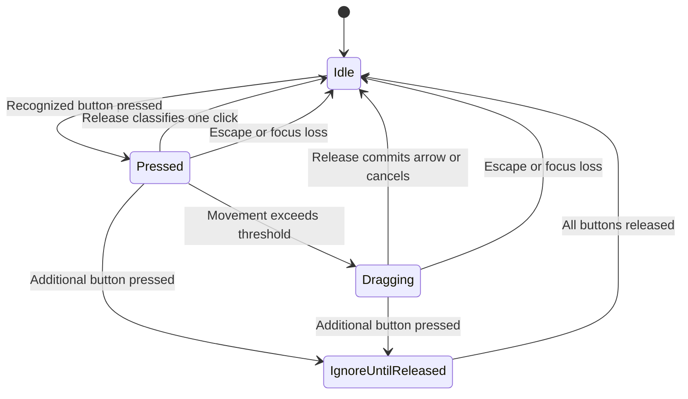

# JavaFX Node and Arrow Editor — System Design

**Version:** 1.0  
**Research date:** 3 September 2026  
**Status:** Implementation specification; the application has not yet been built.  
**Companion:** [System Architecture](system-architecture.md)

## 1. Purpose and scope

Build a desktop editor in which right-clicking creates solid, fixed-radius circles, and dragging from one circle to another creates a directed arrow. A proximity check prevents overlapping circles and instead selects an existing node. The next successful creation connects that selected node to the new node automatically.

Left-clicking deletes a node or arrow. Deleting a node also removes every incoming and outgoing arrow. All graph changes support undo and redo through two stacks implemented with a custom linked list.

This document specifies observable behaviour, geometry, state transitions, history semantics, and acceptance criteria. The architecture document assigns those responsibilities to Java classes and explains the implementation choices. Together they describe a small, single-user, in-memory application.

Node movement, graph algorithms, file persistence, networking, zoom, and collaboration are future extensions. They are not necessary to complete the requested editor.

## 2. Requirements and proposed defaults

### 2.1 Required capabilities

| ID | Requirement | Completion condition |
| --- | --- | --- |
| RQ-01 | Create nodes with right-click | One valid right-click creates exactly one solid circle at that position. |
| RQ-02 | Use a fixed radius | Every node uses the same configured radius throughout a session. |
| RQ-03 | Connect existing nodes by dragging | A primary-button drag from A to B creates A → B. |
| RQ-04 | Anchor arrows at circumferences | The shaft starts on A's boundary; the arrowhead tip ends on B's boundary. |
| RQ-05 | Prevent overlapping creation | A conflicting placement selects an existing node and creates nothing. |
| RQ-06 | Show selection | The selected node has a visible outline while retaining its solid fill. |
| RQ-07 | Connect after selection | Creating B while A is selected creates B and A → B together. |
| RQ-08 | Cancel selection | Right-clicking the same selected node removes its selection. |
| RQ-09 | Delete with left-click | A stationary primary click on a node or arrow deletes that object. |
| RQ-10 | Cascade node deletion | Deleting A removes all arrows whose source or target is A. |
| RQ-11 | Undo and redo graph changes | Creation and deletion of nodes and arrows can be reversed and reapplied. |
| RQ-12 | Restore deleted connections | Undoing node deletion restores its original node and all removed arrows. |
| RQ-13 | Use a dynamic linked-list stack | History grows through linked entries rather than a fixed-size array. |

### 2.2 Decisions that resolve unspecified behaviour

These are proposed implementation defaults, rather than additional requirements attributed to the project brief.

| Question | Chosen behaviour | Reason |
| --- | --- | --- |
| Which button creates a dragged arrow? | Primary/left button. | Fits ordinary desktop dragging; click and drag are classified separately. |
| What direction does an automatic arrow have? | Selected node → newly created node. | The selected node is the connection source. |
| What happens after automatic connection? | Clear selection. The new node is not automatically selected. | One selection arms one automatic connection. |
| What happens after standalone creation? | Leave the new node unselected. | Prevents unrequested chains of arrows. |
| What if a different existing node is right-clicked? | Switch selection to that node; do not create an arrow. | Existing-to-existing connections remain an explicit drag action. |
| Are selection changes undoable? | No. Selection and previews are temporary interaction state. | Undo steps correspond to graph edits. |
| Are duplicate arrows allowed? | At most one A → B, but B → A is independently allowed. | Avoids indistinguishable duplicates while retaining directionality. |
| Are self-loops allowed? | No A → A arrows in this version. | A straight arrow between one circle and itself is undefined. |
| Are touching circles allowed? | Treat touching, within a tiny numerical tolerance, as a proximity conflict. | Prevents a zero-length circumference-to-circumference arrow. |
| Do arrows obstruct placement? | No. Only nodes obstruct creation. | The requested proximity rule concerns circles. |
| What does a primary press do to a pending selection? | Clear it before classifying that primary gesture. | A manual gesture starts a fresh interaction. |
| What happens to selection during undo/redo? | Clear selection and any active gesture before processing history. | Avoids retaining a reference to a removed node. |

### 2.3 Configuration

All distances below are JavaFX canvas-local logical pixels. These defaults can be adjusted centrally before a session begins.

| Constant | Default | Use |
| --- | --- | --- |
| `NODE_RADIUS` | `20.0` | Filled node radius. |
| `DRAG_THRESHOLD` | `5.0` | Maximum displacement before a press becomes a drag. |
| `ARROW_HIT_TOLERANCE` | `6.0` | Distance around the visible arrow used for deletion. |
| `ARROW_STROKE_WIDTH` | `2.0` | Shaft thickness. |
| `MAX_HEAD_LENGTH` | `10.0` | Normal arrowhead length; reduced for short arrows. |
| `MAX_HEAD_HALF_WIDTH` | `4.0` | Normal half-width of the triangular arrowhead. |
| `RECIPROCAL_OFFSET` | `6.0` | Offset of each arrow when both directions exist. Must remain at most `0.3 × NODE_RADIUS`. |
| `SELECTION_STROKE_WIDTH` | `3.0` | Contrasting outline drawn inside the node boundary. |
| `GEOMETRY_EPSILON` | `0.000001` | Linear tolerance for coincident/touching geometry. |
| `SURFACE_WIDTH`, `SURFACE_HEIGHT` | `1200.0`, `800.0` | Fixed drawing surface, inside a scrollable viewport. |

The radius is a session-wide setting. Changing it while a graph exists would change overlap and arrow geometry, so live radius editing is excluded.

## 3. Complete interaction contract

### 3.1 Right-click creation and selection

Here, an **existing-node result** includes both clicking inside a circle and clicking at a location where a new circle would collide with it.

| Previous selection | Right-click result | Graph effect | New selection | History effect |
| --- | --- | --- | --- | --- |
| None | Valid free position P | Create B at P. | None | Push `AddNode(B)`. |
| None | Existing node A | None. | A | None. |
| A | Existing node A | None. | None | None. |
| A | Existing node B | None. | B | None. |
| A | Valid free position P | Create B and A → B atomically. | None | Push one `AddConnectedNode(A, B)`. |
| Any | Invalid position at the surface boundary | None. | Unchanged | None. |
| Any | Release outside the visible drawing area | None. | Unchanged | None. |
| Any | Secondary-button drag | None. | Unchanged | None. |

When several existing nodes would conflict with a proposed circle, choose the nearest centre. Break an exact distance tie using the smaller stable node ID. A direct hit inside an existing circle takes precedence over an indirect proximity result.

Right-clicking an arrow follows the same placement rule: it can create a node there if no circle would collide. Arrows are not selected by secondary clicks.

### 3.2 Primary click and drag

| Gesture | Result |
| --- | --- |
| Press and release on the same node, without crossing the drag threshold | Delete that node and all incident arrows in one edit. |
| Press and release on the same arrow, without crossing the threshold | Delete that arrow only. |
| Press and release on empty space | No graph edit. |
| Press A, cross the threshold, release inside a distinct B | Create A → B if it does not already exist. |
| Drag from A back to A | Cancel; do not delete A. |
| Drag from A to empty space or outside the drawing viewport | Cancel; do not create or delete anything. |
| Drag beginning on an arrow or empty space | No graph edit, including no deletion on release. |
| Click begins on one object but ends on a different object | No deletion. |
| Drag attempts a duplicate A → B | Keep the graph and history unchanged; show a brief explanation. |

Primary presses clear any pending right-click selection. During a connection drag, the source can have a temporary outline and the candidate target a separate hover indication. This does not arm automatic placement.

For click deletion, determine the object on **both press and release**, and require the same object type and ID. Node bodies take priority over arrows wherever their hit areas overlap.

### 3.3 Cancellation and keyboard controls

| Input | Behaviour |
| --- | --- |
| Right-click the selected node | Clear pending selection. |
| Escape | Cancel selection and active gesture; leave graph and history unchanged. |
| Undo toolbar button or `Shortcut+Z` | Cancel interaction state, then undo one complete graph edit if available. |
| Redo toolbar button or `Shortcut+Shift+Z` | Cancel interaction state, then redo one complete graph edit if available. |
| Loss of window focus | Cancel active interaction and selection. |
| Additional mouse button pressed during a gesture | Cancel that gesture; ignore the remaining chord until every button is released. |

Use JavaFX's platform shortcut modifier so these become Ctrl shortcuts on Windows and Command shortcuts on macOS. This mapping is provided by `KeyCombination`, not by hard-coded operating-system checks. [R9]

Leaving the canvas while still holding the mouse button does not immediately commit or cancel a drag: the user may return. A release outside the visible drawing viewport cancels it. A cancelled gesture's eventual mouse release must be ignored.

## 4. Interaction state machine

Keep two separate pieces of state:

- `pendingSourceId`: optional node selected by right-click for the next automatic connection.
- `gesture`: the current press/drag session, or `Idle`.

Separating them prevents a temporary drag source from accidentally becoming the next automatic-connection source.

### 4.1 Gesture states

| State | Stored information | Meaning |
| --- | --- | --- |
| `Idle` | None | No active pointer gesture. |
| `Pressed` | Button, press point, press hit, maximum displacement | An interaction has begun, but no graph change is committed. |
| `Dragging` | Button, original press hit, current point | Threshold crossed; this gesture can no longer be a deletion click. |
| `IgnoreUntilReleased` | Current button state | A cancelled mouse chord is being drained. |



Undo and redo also transition any active gesture to `Idle` before accessing history. The diagram shows gesture lifecycle; the right-click selection transitions are defined by the table in section 3.1.

### 4.2 Why click deletion must wait

JavaFX documents that a click event may follow a long drag, and that the ordinary press-drag-release gesture remains associated with its original event target. [R3]

For this editor, deletion therefore happens only in the release classifier. Do not attach an additional deleting handler to `MOUSE_CLICKED`, and do not delete on `MOUSE_PRESSED`.

Track the maximum squared displacement since the press:

```text
movementSquared = (currentX - pressX)^2 + (currentY - pressY)^2
maxMovementSquared = max(maxMovementSquared, movementSquared)

if maxMovementSquared > DRAG_THRESHOLD^2:
    gesture becomes Dragging permanently for this press
```

Update this value for drag events and once more on release. Returning the cursor to the start cannot turn an earlier drag back into a click. The explicit threshold is the project's gesture policy; do not mix it with a second, competing threshold in another handler.

### 4.3 Primary-release pseudocode

```text
onPrimaryReleased(point):
    session = current gesture
    current gesture = Idle

    if session is absent or belongs to another button:
        return

    update session maximum displacement using point
    if point is outside the visible drawing area:
        return

    if session crossed the drag threshold:
        if session.pressHit is not a node:
            return
        target = hitNodeBody(point)
        if target is absent or target.id == session.pressHit.id:
            return
        attempt one AddArrow(sourceId, target.id) command
        return

    releaseHit = hitNodeFirstThenArrow(point)
    if releaseHit != session.pressHit:
        return
    if releaseHit is a node:
        attempt one DeleteNode command with every incident arrow
    else if releaseHit is an arrow:
        attempt one DeleteArrow command
```

An absent or invalid target generates no command. The same release must never reach both the connection and deletion paths.

## 5. Node Proximity Handler

### 5.1 Two different geometric questions

For an existing node centre `C = (cx, cy)` and pointer position `P = (px, py)`, define:

```text
dSquared = (px - cx)^2 + (py - cy)^2
```

**Node body hit:** `dSquared <= R^2`. Use this for primary-click deletion and drag source/target detection.

**Placement conflict:** `dSquared <= (2R + epsilon)^2`. Use this when deciding whether a new radius-R circle can be created.

The factor `2R` is essential: the candidate and existing circle each have radius R. Testing only `R` would reject clicks inside a circle while still allowing two circles to overlap.

For example, with `R = 20`, centres 30 pixels apart would overlap even though the second centre lies outside the first circle. A right-click there must select the existing node, not create a new one.

The tiny linear epsilon is added before squaring. It is not a six-pixel proximity margin and should not enlarge the selection area visibly.

### 5.2 Placement classification

The following pseudocode shows the complete placement workflow. The controller performs the viewport-visibility check before calling the pure Node Proximity Handler; the handler itself receives canvas-local coordinates, graph data, and fixed surface bounds, with no dependency on JavaFX controls.

```text
classifyPlacement(P):
    reject non-finite coordinates
    if P is outside the visible canvas area:
        return OutsideSurface

    if hitNodeBody(P) returns a node:
        return ExistingNode(that node)

    candidates = nodes satisfying distanceSquared(P, centre) <= (2R + epsilon)^2
    if candidates is not empty:
        return ExistingNode(minimum by distanceSquared, then node ID)

    if P.x < R or P.x > surfaceWidth - R
       or P.y < R or P.y > surfaceHeight - R:
        return OutsideSurface

    return FreePosition(P)
```

Selection of an existing node precedes the full-circle boundary check. Thus, a click near the surface edge can still select a nearby existing node even if a hypothetical new circle there would extend outside the surface.

Scan all node centres initially. This is O(V), needs no additional spatial structure, and is easy to verify. If later profiling demonstrates a need, a uniform spatial grid can replace the scan behind the same interface.

### 5.3 Selection appearance

Draw the same solid circle as usual, then stroke a contrasting circle of radius `R - selectionStrokeWidth / 2`. Its outer boundary remains at R, so selection does not change collision geometry or get clipped at the drawing-surface boundary.

Show a status message such as: “Node N3 selected. Right-click free space to add a connected node; right-click N3 to cancel.” Use the outline and message together so the user can distinguish selection from a temporary hover.

## 6. Arrow geometry and hit testing

The equations in this section are derived for this project. They describe logical geometry; rasterization may introduce subpixel antialiasing at a boundary.

### 6.1 A single directed arrow

Let source centre A and target centre B be distinct two-dimensional points. Let `R` be their common radius.

```text
D = B - A
d = length(D)
u = D / d                 // unit vector toward B
n = (-u.y, u.x)           // perpendicular unit vector

S = A + R*u              // visible shaft start
T = B - R*u              // arrowhead tip
L = d - 2R               // available arrow length
```

The source anchor satisfies `length(S - A) = R`; the target anchor satisfies `length(T - B) = R`. The arrow therefore starts and ends on the appropriate circumferences, rather than at the centres.

Example: A = `(100, 100)`, B = `(220, 100)`, R = `20`. Then S = `(120, 100)` and T = `(200, 100)`, leaving an 80-pixel arrow.

Avoid special cases based on slope: dividing by `dx` would fail for vertical arrows. Unit vectors work in every direction, including JavaFX's downward-increasing y-axis.

Reject coincident or touching centres before calculating the direction. Normal placement already prevents this; the geometry service must still reject invalid input rather than produce NaN coordinates.

### 6.2 Arrowhead construction

```text
headLength = min(MAX_HEAD_LENGTH, 0.45 * L)
headHalfWidth = min(MAX_HEAD_HALF_WIDTH, 0.4 * headLength)

H = T - headLength*u
Q1 = H + headHalfWidth*n
Q2 = H - headHalfWidth*n

draw shaft from S to H
fill triangle with vertices T, Q1, Q2
```

Use a butt cap for the shaft. The filled triangle supplies the terminal point; do not add a centre-to-centre line underneath it.

Reducing head size with L makes arrows between nearly touching nodes mathematically valid. Such arrows can become very small on screen; the editor does not silently move the nodes or introduce a large extra spacing requirement. To inspect them, the user may need to recreate the nodes farther apart.

### 6.3 Opposite directions between the same two nodes

If both A → B and B → A exist, two centreline arrows would lie over each other. Give each direction its own straight, slightly offset lane while keeping both endpoints exactly on circle boundaries.

For each arrow independently, compute u and n from its own source to its own target:

```text
h = RECIPROCAL_OFFSET if reverse arrow exists, otherwise 0
a = sqrt(R^2 - h^2)

S = A + h*n + a*u
T = B + h*n - a*u
L = d - 2*a
```

Use the same head construction from section 6.2. Because u and n reverse for B → A, its lane is on the opposite physical side.

The boundary proof is `length(h*n + a*u)^2 = h^2 + a^2 = R^2`; the corresponding expression at the target is identical. With R = 20 and h = 6, a is approximately 19.0788.

This is a deliberate handling rule for an unspecified edge case. It permits both directions without introducing curved arrows or overlapping duplicate shafts. The offset bound and proportional head dimensions keep the head narrow relative to its lane.

Adding or removing a reverse arrow changes the geometry of the surviving arrow as well. Rebuild derived arrow geometry after every committed graph edit, undo, and redo. Arrow records store endpoint IDs, not cached endpoint coordinates.

### 6.4 Selecting a thin arrow for deletion

For pointer P and shaft segment S–H, calculate the closest point on the finite segment:

```text
v = H - S
if dot(v, v) is effectively zero:
    closest = S
else:
    t = clamp(dot(P - S, v) / dot(v, v), 0, 1)
    closest = S + t*v

shaftDistanceSquared = distanceSquared(P, closest)
```

Clamping matters: clicking along an imaginary extension beyond the arrow must not count as clicking its shaft.

For the head, use a point-in-triangle check. If P lies inside, its distance to the filled head is zero. Otherwise, take the minimum point-to-segment distance to the three triangle edges. An arrow is a candidate if the smaller of its shaft/head distances is at most `ARROW_HIT_TOLERANCE`.

Among arrow candidates, choose the smallest distance. If distances are equal within the geometry tolerance, prefer the larger arrow ID, which is drawn later. The renderer and hit tester must use the same current `ArrowGeometry` values, including reciprocal offsets and scaled heads.

Always test node bodies first. This prevents a click on a node from unexpectedly deleting an arrow near its endpoint. The larger placement-conflict radius is never used for deletion.

### 6.5 Previews and crossings

While dragging over a valid target, preview the eventual arrow using the same geometry policy, including a reciprocal lane if required. If the provisional reverse arrow would shift an existing arrow, render that affected arrow in its provisional lane for the preview frame too. These are temporary drawing changes, not model mutations.

While dragging over free space outside the source circle, draw a dashed guide from the source circumference toward the cursor. This guide is not a committed graph arrow. When the pointer is inside the source circle, omit the guide to avoid a reversed or degenerate preview. A duplicate or invalid target receives an explanatory status message.

Arrows may cross other arrows. A crossing is not a new graph node. Arrows may also pass behind unrelated circles: draw filled circles after arrows so their bodies cover the crossing portions. Automatic obstacle routing is outside this version's scope.

## 7. Graph data and invariants

### 7.1 Logical entities

| Entity | Fields | Notes |
| --- | --- | --- |
| `GraphNode` | `long id`, `double x`, `double y` | Immutable position and identity. Radius comes from session configuration. |
| `GraphArrow` | `long id`, `long sourceId`, `long targetId` | Immutable directed connection. |
| `DirectedPair` | `long sourceId`, `long targetId` | Key used to reject duplicate directed arrows. |
| `GraphDelta` | Lists of added/removed nodes and added/removed arrows | Immutable payload for one complete edit. |
| `InteractionState` | Optional pending source, gesture data, preview | Temporary state outside graph history. |

Use the name `GraphNode` to avoid confusion with `javafx.scene.Node` and the linked stack's internal `Entry` type.

IDs are unique within their entity type and allocated monotonically. Undo and redo restore the same records and IDs; they never renumber the graph. ID allocators are not rewound, so gaps are acceptable after an abandoned history branch.

### 7.2 Conditions that must always hold after a completed edit

1. Every arrow's source and target exist, and they are different nodes.
2. No two arrows have the same ordered `(sourceId, targetId)` pair.
3. Node coordinates are finite, and every node lies fully inside the fixed drawing surface.
4. Distinct node centres are farther apart than `2R + epsilon`.
5. Every arrow is present in the incident-arrow index of both endpoints and in no unrelated incident set.
6. Each endpoint-pair index entry identifies exactly one matching arrow.
7. History payloads retain immutable record values rather than references to mutable collections.
8. A selected source, when present, refers to a live node; no preview survives a cancelled gesture.
9. A completed command occupies either the undo stack or the redo stack, never both.
10. A rejected operation changes neither graph contents nor either history stack.

The graph's revision counter increases after successful execute, undo, and redo. It is a cache-invalidation marker, not historical graph content. Equality checks for restoration compare node and arrow records; they exclude revision counters, ID allocator counters, scroll position, and temporary selection.

## 8. Undo and redo semantics

### 8.1 One user action is one history entry

Use one combined history for nodes and arrows, rather than separate per-entity histories. Otherwise, undo could remove a node before an arrow that still depends on it.

Commands store a description and the records required to apply or reverse an edit. This adapts the Command pattern's separation of requests from their invocation. [R6]

| Command kind | Saved payload | Apply/redo order | Undo order |
| --- | --- | --- | --- |
| `AddNode` | New node | Add node. | Remove node. |
| `AddArrow` | New arrow | Add arrow and update indexes. | Remove arrow and update indexes. |
| `AddConnectedNode` | New node and selected-source → new-node arrow | Add node, then arrow. | Remove arrow, then node. |
| `DeleteArrow` | Exact deleted arrow | Remove arrow. | Restore arrow. |
| `DeleteNode` | Exact deleted node and all its incident arrows | Remove arrows, then node. | Restore node, then arrows. |

These command kinds can be constructed by factory methods returning one `GraphEditCommand` type; five repetitive command classes are unnecessary. A connected-node creation and a cascading deletion each carry one complete delta.

Reversing dependent changes in reverse order also follows the composition behaviour documented for Java's `CompoundEdit`. This project implements its own history rather than importing Swing's undo manager. [R7]

### 8.2 Two custom linked-list stacks

```text
undoStack: LinkedStack<EditCommand>
redoStack: LinkedStack<EditCommand>
```

Each stack has a head reference and a size. Each linked entry contains one command and a reference to the next entry. Pushing inserts at the head; popping removes the head. Both are O(1) and need no traversal or fixed capacity.

The graph may use maps for IDs and adjacency; the explicit linked-list requirement applies to the undo and redo stacks. The architecture document provides the stack contract and implementation skeleton.

### 8.3 History algorithms

```text
executeNew(command):
    result = command.applyAtomically(model)
    if result is not APPLIED:
        return result
    undoStack.push(command)
    redoStack.clear()
    publish one completed change

undo():
    cancel interaction state
    if undoStack.isEmpty():
        return NO_CHANGE
    command = undoStack.peek()
    if command.revertAtomically(model) succeeds:
        undoStack.pop()
        redoStack.push(command)
        publish one completed change

redo():
    cancel interaction state
    if redoStack.isEmpty():
        return NO_CHANGE
    command = redoStack.peek()
    if command.applyAtomically(model) succeeds:
        redoStack.pop()
        undoStack.push(command)
        publish one completed change
```

Move entries only after the corresponding model operation succeeds. Redo reuses the stored command, original IDs, coordinates, and directions. It does not run `executeNew`, consult the current selection, or reconstruct the gesture.

A successful new edit clears redo because it starts a different history branch. Selecting, deselecting, clicking empty space, cancelling a drag, rejecting a duplicate, or rejecting an out-of-bounds placement must not clear redo.

### 8.4 Atomicity and snapshots

Before deleting node A, copy A and every distinct arrow incident on it. Both incoming and outgoing arrows belong in this snapshot. Removing A → B and B → A removes two separate arrow records.

Validate the entire intended edit before mutation. In an automatic creation, validation must account for the new node as a prospective endpoint. In a node deletion, validate that every currently incident arrow is included in the removal set.

Apply removals as arrows before nodes, and additions as nodes before arrows. Perform these changes on a private working copy of the graph collections, and replace the live graph state only after the complete edit succeeds. Publish no intermediate redraw or history change. Validation failures and ordinary recoverable failures discard the working copy and leave history unmoved. The temporary copy is not retained in undo history; the architecture document explains its cost and ownership.

Restoration uses the saved data, including IDs and arrow directions. Selection is deliberately not restored: undoing a deletion brings back the graph without silently arming an automatic connection.

### 8.5 Worked history trace

Notation: the leftmost command is the stack top. `C1` creates A; `C2` creates B plus A → B; `C3` deletes A with its incident arrow.

| Step | Graph | Undo stack, top first | Redo stack, top first |
| --- | --- | --- | --- |
| Initial | Empty | Empty | Empty |
| Right-click to create A | A | C1 | Empty |
| Right-click A to select it | A | C1 | Empty |
| Right-click free space | A, B, A → B | C2, C1 | Empty |
| Left-click A | B | C3, C2, C1 | Empty |
| Undo | A, B, A → B | C2, C1 | C3 |
| Undo | A | C1 | C2, C3 |
| Redo | A, B, A → B | C2, C1 | C3 |
| Select and deselect A | A, B, A → B | C2, C1 | C3 |
| Create a new standalone C | A, B, C, A → B | C4, C2, C1 | Empty |

After the final step, C3 cannot be redone. A new graph edit has replaced that possible future. This is intentional linear undo/redo behaviour.

## 9. Rendering and feedback contract

Use an actual `javafx.scene.canvas.Canvas`. JavaFX describes it as an image receiving graphics commands, with drawing clipped to its dimensions. The logical circles in this application are data records drawn into that image. [R1]

For each requested frame:

1. Clear the canvas and paint the background.
2. Draw committed arrows in ascending arrow-ID order.
3. Draw the active guide or connection preview, if any.
4. Draw all solid circles in ascending node-ID order.
5. Draw pending-selection and temporary interaction outlines.

During a reciprocal preview, substitute the affected existing arrow's provisional geometry in step 2. On cancellation, the next frame uses committed geometry again.

All drawing and UI updates occur on the JavaFX Application Thread, as required for a canvas attached to a scene. `GraphicsContext.save()` and `restore()` isolate drawing styles; they do not undo graph edits or restore an earlier image. [R2]

The surface has a fixed logical size inside a `ScrollPane`. Resizing the application changes the visible viewport rather than node coordinates or radius. Disable drag-based panning so it does not compete with primary-button arrow creation. Scrolling remains available through scrollbars and ordinary scrolling.

Convert incoming scene coordinates to canvas-local coordinates. Release validation must check both the logical canvas and the clipped drawing viewport, so releasing over a scrollbar cannot create a connection to content hidden behind it.

Provide Undo and Redo buttons whose disabled state matches history availability. Their labels or tooltips can identify the next operation, such as “Undo delete node N4.” A status line describes selection, successful edits, and rejected gestures; graph actions do not require confirmation dialogs.

## 10. Edge cases and expected handling

| Case | Required handling |
| --- | --- |
| Pointer is outside the drawing surface | Ignore creation and connection completion. |
| Candidate circle extends past a surface edge | Reject creation; retain a pending selection. |
| Candidate would overlap two nodes | Select the nearest, with deterministic ID tie-breaking. |
| Candidate circles would just touch | Treat as a proximity conflict. |
| Two nodes have a very small positive gap | Scale down the arrowhead; do not divide by zero. |
| Arrow passes underneath a node | The solid node covers it; a body click deletes the node. |
| Two arrows cross | Choose nearest visible arrow geometry, then the later-drawn arrow on a tie. |
| A → B and B → A coexist | Use separate offset lanes; either arrow is independently deletable. |
| Node has no arrows | Its deletion is still one reversible edit. |
| Node has many incoming and outgoing arrows | Snapshot and remove all of them exactly once. |
| Undo or redo is empty | No graph mutation and no error dialog. |
| User performs a non-edit after undo | Keep the redo stack intact. |
| Gesture is cancelled, then its release arrives | Ignore the stale release. |
| Window loses focus during dragging | Remove preview and reset gesture state. |
| Surface contains enough nodes to block a proposed location | Select a conflicting node; do not relocate the new node automatically. |

## 11. Acceptance and verification plan

The following are implementation acceptance criteria. They are not claims that a JavaFX application has already passed them.

### 11.1 Behaviour and geometry

| Test | Setup and action | Expected result | Requirements |
| --- | --- | --- | --- |
| T01 | Right-click `(100,100)` on an empty surface. | One filled node centred there, radius 20; undo count increases by one. | RQ-01, RQ-02 |
| T02 | With A at `(100,100)`, right-click `(130,100)`. | Select A, create nothing; history unchanged. | RQ-05, RQ-06 |
| T03 | Right-click selected A again. | Outline disappears; no graph edit. | RQ-08 |
| T04 | Select A and right-click valid `(220,100)`. | Create B and A → B; selection clears; exactly one history entry. | RQ-07, RQ-11 |
| T05 | Primary-drag from A to an existing B. | One directed arrow A → B; both nodes remain. | RQ-03 |
| T06 | A = `(100,100)`, B = `(220,100)`. | Single-arrow anchors are `(120,100)` and `(200,100)`. | RQ-04 |
| T07 | Generate vertical, diagonal, and reverse-direction node pairs. | Each anchor is radius R from its own endpoint centre; finite coordinates. | RQ-04 |
| T08 | Click just outside A's body but within 2R. | Primary click does not delete A; secondary click selects A. | RQ-05, RQ-09 |
| T09 | Primary-click arrowhead and then, in a separate setup, its shaft. | Either visible part can identify the arrow for deletion. | RQ-09 |
| T10 | Click beyond an arrow's endpoint along its infinite line. | No hit unless the pointer is actually within tolerance of visible geometry. | RQ-09 |
| T11 | Create both A → B and B → A. | Distinct lanes; four anchors lie on their respective circles. | RQ-03, RQ-04 |
| T12 | Delete one arrow from a reciprocal pair, then undo. | Survivor recentres on deletion; both lanes return on undo. | RQ-04, RQ-11 |
| T13 | Attempt a duplicate or a self-loop. | No graph or history change; no accidental deletion. | RQ-03, RQ-11 |
| T14 | Attempt a circle at a tangent position and just beyond the allowed threshold. | Tangency selects existing node; valid separated placement succeeds. | RQ-04, RQ-05 |

### 11.2 Gesture conflicts and history integrity

| Test | Setup and action | Expected result | Requirements |
| --- | --- | --- | --- |
| T15 | Drag away from A beyond 5 pixels, then return and release on A. | Neither an arrow nor a deletion; A remains. | RQ-03, RQ-09 |
| T16 | Make a small stationary click with movement below the threshold. | One deletion on release, never on press. | RQ-09 |
| T17 | Drag from empty space or an arrow and release elsewhere. | No graph edit. | RQ-03, RQ-09 |
| T18 | Cancel a drag with Escape, then release. | No command; no stale preview or accidental deletion. | RQ-03, RQ-11 |
| T19 | Delete A with incoming, outgoing, and reciprocal connections. | A and all its incident arrows disappear; unrelated graph data remains. | RQ-09, RQ-10 |
| T20 | Undo T19, then redo it. | Exact IDs, coordinates and directions return on undo and disappear on redo. | RQ-11, RQ-12 |
| T21 | Undo an automatic connected-node creation. | Remove its arrow and new node together; original source remains. | RQ-07, RQ-11 |
| T22 | Undo, perform selection/cancellation/invalid placement, then redo. | The original redo remains available and restores the saved edit. | RQ-11 |
| T23 | Undo, make a valid new graph edit, then attempt redo. | Redo is unavailable because a new branch was created. | RQ-11 |
| T24 | Inject an ordinary failure after the first mutation of a compound edit. | Rollback restores graph and indexes; history stacks do not move. | RQ-07, RQ-10–12 |
| T25 | Push and pop many stack entries; clear an empty and a nonempty stack. | Correct LIFO sequence and sizes; no fixed array capacity. | RQ-13 |
| T26 | Undo all edits, then redo all edits in a mixed session. | Empty graph after full undo; exact final graph after full redo. | RQ-11, RQ-12 |
| T27 | Scroll and resize, then click/drag in the drawing viewport. | Coordinates remain correct; releases on scrollbars do not edit hidden content. | RQ-01, RQ-03 |
| T28 | Invoke undo during a drag, then release the button. | One history operation; stale release produces no additional edit. | RQ-11 |

### 11.3 Properties worth testing independently

- **Restoration:** applying a valid edit and then its inverse produces the same node and arrow records as before.
- **Replay:** undo followed by redo restores the prior graph contents with original IDs.
- **Reference integrity:** every arrow endpoint exists after every completed operation.
- **Index agreement:** incident sets and endpoint-pair lookups match the canonical arrow collection.
- **Geometry:** both anchors lie on the correct circle; no committed arrow has zero or non-finite length.
- **Atomicity:** failure cannot leave half an automatic creation or half a cascading deletion.

Use pure Java tests for geometry, the graph, commands, and stacks. Use JavaFX interaction tests or a short manual checklist for actual event delivery, mouse thresholds, focus changes, scrolling, and rendering. Mathematical checks alone cannot verify native mouse behaviour.

### 11.4 Design checks completed during authoring

A numerical reference calculation evaluated 8,000 arrow configurations across arbitrary directions, nearly touching circles, and both centreline and reciprocal lanes. Endpoint distances matched the 20-pixel circle radius to within approximately `3.3 × 10^-13` pixels in those calculations. The checks also confirmed finite coordinates and arrowhead/shaft segments outside the two endpoint-circle interiors, within numerical tolerance.

The horizontal worked example and finite-segment endpoint clamp were checked separately. Markdown source references, companion-file links, and code-fence balance were also checked. These validate the written specification's equations and structure; the JavaFX UI, Java implementation, transaction code, and listed acceptance tests still require implementation and execution.

## 12. Research references

The sources below establish JavaFX API behaviour and the relevant design patterns. The interaction policies, equations, constants, and acceptance tests are project-specific design decisions.

| Reference | Source | Relevance |
| --- | --- | --- |
| R1 | [OpenJFX: Canvas, JavaFX 26][R1] | Drawing surface, image bounds, and graphics-command model. |
| R2 | [OpenJFX: GraphicsContext, JavaFX 26][R2] | Drawing operations, graphics-state stack, and application-thread rules. |
| R3 | [OpenJFX: MouseEvent, JavaFX 26][R3] | Press/drag/release delivery and the possibility of clicks following drags. |
| R6 | [Refactoring.Guru: Command pattern][R6] | Encapsulating edits so invocation and reversal can be managed uniformly. |
| R7 | [Oracle: CompoundEdit, Java SE 25][R7] | Replaying component edits forward and undoing them in reverse order. |
| R9 | [OpenJFX: KeyCombination, JavaFX 26][R9] | Portable shortcut modifier. |

[R1]: https://openjfx.io/javadoc/26/javafx.graphics/javafx/scene/canvas/Canvas.html
[R2]: https://openjfx.io/javadoc/26/javafx.graphics/javafx/scene/canvas/GraphicsContext.html
[R3]: https://openjfx.io/javadoc/26/javafx.graphics/javafx/scene/input/MouseEvent.html
[R6]: https://refactoring.guru/design-patterns/command
[R7]: https://docs.oracle.com/en/java/javase/25/docs/api/java.desktop/javax/swing/undo/CompoundEdit.html
[R9]: https://openjfx.io/javadoc/26/javafx.graphics/javafx/scene/input/KeyCombination.html
